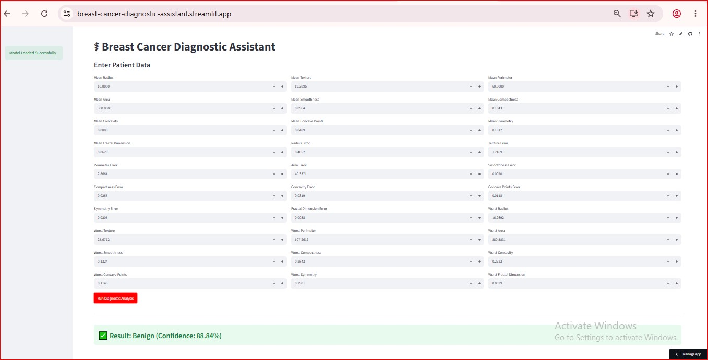

# ⚕️ Breast Cancer Diagnostic Assistant

[](https://colab.research.google.com/github/EmmanuelEjima/Data-Science-Machine-Learning-Portfolio/blob/main/projects/breast-cancer-diagnostic-app/Breast%20Cancer%20Detection%20Model.ipynb)
[](https://breast-cancer-diagnostic-assistant.streamlit.app/)

## 📷 Application Preview

<p align="center">
  
</p>

An end-to-end Machine Learning web application that predicts whether a breast tumor is **Malignant** or **Benign** using the **Wisconsin Diagnostic Breast Cancer (WDBC)** dataset. The project demonstrates the complete machine learning lifecycle, from data preprocessing and model training to cloud deployment using **Streamlit Community Cloud**.


## 📌 Project Overview

This project implements a standardized Machine Learning pipeline for breast cancer diagnosis. Users can enter **30 clinical features** extracted from Fine Needle Aspirate (FNA) images of breast masses, and the application predicts whether the tumor is **Malignant** or **Benign**.

The project demonstrates best practices in:

- Data preprocessing
- Feature engineering
- Model evaluation
- Model serialization
- Web application deployment
- Reproducible machine learning workflows

---

## ✨ Features

- Interactive Streamlit web application
- Complete 30-feature clinical input interface
- Real-time prediction (Malignant or Benign)
- Logistic Regression classifier
- StandardScaler preprocessing pipeline
- Serialized model using Joblib
- Production-ready deployment
- Responsive user interface

---

## 📊 Machine Learning Workflow

- Data Loading
- Exploratory Data Analysis (EDA)
- Data Preprocessing
- Feature Scaling using StandardScaler
- Model Training
- Cross Validation
- Model Evaluation
- Model Serialization (`.pkl`)
- Streamlit Deployment

---

## 📈 Model Performance

| Metric | Value |
|---------|-------|
| **Algorithm** | Logistic Regression |
| **Dataset** | Wisconsin Diagnostic Breast Cancer (WDBC) |
| **Cross-Validation Accuracy** | **≈98.1%** |
| **Framework** | Scikit-learn |

---

## 🛠️ Technologies Used

- Python
- Streamlit
- Scikit-learn
- Pandas
- NumPy
- Joblib
- Google Colab
- Git
- GitHub

---

## 📂 Project Structure

```text
breast-cancer-diagnostic-app/
│
├── Breast Cancer Detection Model.ipynb
├── app.py
├── README.md
├── requirements.txt
└── models/
    ├── breast_cancer_model.pkl
    └── scaler.pkl
```

---

## ▶️ Run the Project Locally

### Clone the repository

```bash
git clone https://github.com/EmmanuelEjima/Data-Science-Machine-Learning-Portfolio.git
```

### Navigate to the project folder

```bash
cd projects/breast-cancer-diagnostic-app
```

### Install dependencies

```bash
pip install -r requirements.txt
```

### Launch the application

```bash
streamlit run app.py
```

---

## 📚 Dataset

The model was trained using the **Wisconsin Diagnostic Breast Cancer (WDBC)** dataset available through Scikit-learn.

Each observation contains **30 numerical features** computed from digitized images of Fine Needle Aspirate (FNA) of breast masses and is classified as either:

- 🔴 **Malignant (Cancerous)**
- 🟢 **Benign (Non-cancerous)**

---

## 📌 Future Improvements

- Prediction probability/confidence score
- Interactive visual analytics
- Feature importance visualization
- Multiple machine learning model comparison
- Explainable AI (SHAP/LIME)
- Docker containerization
- CI/CD deployment pipeline

---

## ⚠️ Disclaimer

This application is intended for **educational, research, and portfolio purposes only**. It is **not a medical diagnostic system** and should not replace professional medical advice or clinical decision-making.

---

## 👨‍💻 Author

**Emmanuel Ejima**

Chemical Engineer | Data Science & Machine Learning Enthusiast | Renewable Energy Engineer

- **GitHub:** https://github.com/EmmanuelEjima
- **LinkedIn:** https://linkedin.com/in/emmanuel-ejima

---

⭐ **If you found this project useful, consider giving it a Star on GitHub!**
